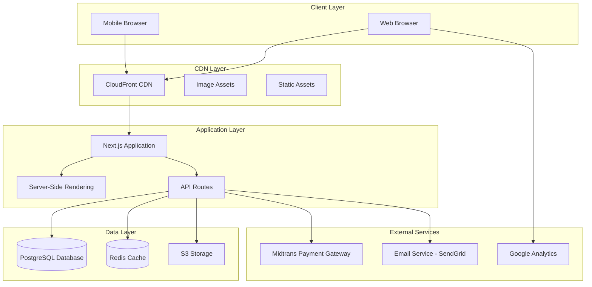

# Design Document: Hiameerah E-Commerce Website

## Overview

### Purpose

The Hiameerah e-commerce website is a modern, scalable platform designed to showcase and sell hijab and modest fashion products while embodying Indonesian cultural heritage and brand values. The platform prioritizes user experience through interactive product displays, smooth animations, and intuitive navigation, inspired by industry leaders like Haute Hijab while maintaining a unique Indonesian identity.

### Design Philosophy

The design follows these core principles:

1. **Performance-First**: Optimize for fast load times and smooth interactions through lazy loading, code splitting, and image optimization
2. **Mobile-First Responsive**: Design for mobile devices first, progressively enhancing for larger screens
3. **Accessibility**: Ensure WCAG 2.1 AA compliance for inclusive user experience
4. **Scalability**: Architecture supports growth in products, traffic, and features
5. **Brand Identity**: Soft, feminine aesthetic with Indonesian cultural elements
6. **SEO-Optimized**: Server-side rendering and structured data for search visibility

### Key Features

- Interactive product catalog with hover effects and quick view
- Hero slideshow with smooth transitions
- Advanced filtering, sorting, and search capabilities
- Shopping cart and wishlist with persistent storage
- Integrated payment gateway (Midtrans)
- Comprehensive admin panel for content and order management
- Rich content sections (blog, lookbook, fabric guides)
- Optimized performance with lazy loading and CDN delivery

## Architecture

### High-Level System Architecture



### Architecture Patterns

**1. Jamstack Architecture**

- Static generation for content pages (about, fabric guide, blog posts)
- Server-side rendering for dynamic pages (product catalog, product details)
- API routes for backend logic and database operations
- CDN distribution for global performance

**2. Component-Based Architecture**

- Reusable React components with clear separation of concerns
- Atomic design methodology (atoms, molecules, organisms, templates, pages)
- Shared component library for consistency

**3. API-First Design**

- RESTful API endpoints for all data operations
- Clear separation between frontend and backend logic
- Enables future mobile app development

**4. Microservices-Ready**

- Modular service structure (products, orders, users, content)
- Can be extracted to separate services as scale demands

### Data Flow

**Product Browsing Flow:**

```
User Request → CDN (cached) → Next.js SSR → Database Query →
Redis Cache Check → Render HTML → Return to Client
```

**Shopping Cart Flow:**

```
Add to Cart → Local State Update → Browser Storage Persist →
Checkout → API Route → Database Transaction → Payment Gateway →
Order Confirmation
```

**Admin Operations Flow:**

```
Admin Action → Authentication Check → API Route →
Database Update → Cache Invalidation → Response
```

## Technology Stack

### Frontend Stack

**Framework: Next.js 14+ (App Router)**

- **Rationale**:
  - Server-side rendering for SEO and performance
  - Built-in image optimization
  - API routes for backend logic
  - File-based routing
  - Excellent developer experience
  - Strong TypeScript support

**UI Library: React 18+**

- **Rationale**:
  - Component-based architecture
  - Large ecosystem and community
  - Excellent performance with concurrent features
  - Hooks for state management

**Styling: Tailwind CSS + CSS Modules**

- **Rationale**:
  - Utility-first approach for rapid development
  - Excellent responsive design utilities
  - Small bundle size with purging
  - CSS Modules for component-specific styles
  - Easy theming and customization

**State Management: Zustand + React Query**

- **Zustand**: Lightweight global state (cart, wishlist, UI state)
- **React Query**: Server state management, caching, and synchronization
- **Rationale**: Simple, performant, and avoids Redux complexity

**Form Handling: React Hook Form + Zod**

- **React Hook Form**: Performant form management with minimal re-renders
- **Zod**: TypeScript-first schema validation
- **Rationale**: Type-safe validation with excellent DX

**Animation: Framer Motion**

- **Rationale**:
  - Declarative animations
  - Gesture support
  - Layout animations
  - Excellent performance

**Image Handling: Next.js Image + Sharp**

- **Rationale**:
  - Automatic optimization
  - Responsive images
  - Lazy loading
  - WebP conversion

### Backend Stack

**Runtime: Node.js 20+ LTS**

- **Rationale**:
  - JavaScript/TypeScript consistency
  - Excellent performance
  - Large ecosystem

**API Framework: Next.js API Routes**

- **Rationale**:
  - Integrated with frontend
  - Serverless-ready
  - TypeScript support
  - Simple deployment

**Database: PostgreSQL 15+**

- **Rationale**:
  - ACID compliance for transactions
  - JSON support for flexible data
  - Excellent performance
  - Strong data integrity
  - Full-text search capabilities

**ORM: Prisma**

- **Rationale**:
  - Type-safe database access
  - Excellent migration system
  - Auto-generated types
  - Great developer experience

**Caching: Redis 7+**

- **Rationale**:
  - Fast in-memory caching
  - Session storage
  - Rate limiting
  - Real-time features support

**File Storage: AWS S3 or Cloudflare R2**

- **Rationale**:
  - Scalable object storage
  - CDN integration
  - Cost-effective
  - High availability

**Payment Gateway: Midtrans**

- **Rationale**:
  - Indonesian market focus
  - Multiple payment methods
  - Good documentation
  - Reliable service

**Email Service: SendGrid or Resend**

- **Rationale**:
  - Reliable delivery
  - Template support
  - Analytics
  - Good API

### DevOps & Infrastructure

**Hosting: Vercel (Primary) or AWS**

- **Vercel**:
  - Optimized for Next.js
  - Automatic deployments
  - Edge network
  - Serverless functions
- **AWS Alternative**:
  - EC2 for application
  - RDS for database
  - S3 for storage
  - CloudFront for CDN

**CDN: Cloudflare or CloudFront**

- **Rationale**:
  - Global edge network
  - DDoS protection
  - Image optimization
  - Fast content delivery

**Monitoring: Sentry + Vercel Analytics**

- **Sentry**: Error tracking and performance monitoring
- **Vercel Analytics**: Web vitals and user analytics

**CI/CD: GitHub Actions**

- **Rationale**:
  - Integrated with repository
  - Free for public repos
  - Flexible workflows

### Development Tools

**Language: TypeScript 5+**

- **Rationale**: Type safety, better IDE support, fewer runtime errors

**Package Manager: pnpm**

- **Rationale**: Fast, efficient, strict dependency management

**Code Quality:**

- **ESLint**: Linting
- **Prettier**: Code formatting
- **Husky**: Git hooks
- **lint-staged**: Pre-commit checks

**Testing:**

- **Vitest**: Unit testing (fast, Vite-powered)
- **React Testing Library**: Component testing
- **Playwright**: E2E testing
- **MSW**: API mocking

## Components and Interfaces

### Component Architecture

The application follows atomic design principles with a clear component hierarchy:

```
src/
├── components/
│   ├── atoms/           # Basic building blocks
│   │   ├── Button/
│   │   ├── Input/
│   │   ├── Image/
│   │   ├── Badge/
│   │   ├── Icon/
│   │   └── Typography/
│   ├── molecules/       # Simple component combinations
│   │   ├── ProductCard/
│   │   ├── SearchBar/
│   │   ├── FilterOption/
│   │   ├── CartItem/
│   │   └── Breadcrumb/
│   ├── organisms/       # Complex components
│   │   ├── Header/
│   │   ├── Footer/
│   │   ├── ProductGrid/
│   │   ├── HeroSlideshow/
│   │   ├── FilterSidebar/
│   │   ├── ShoppingCart/
│   │   └── QuickViewModal/
│   ├── templates/       # Page layouts
│   │   ├── MainLayout/
│   │   ├── AdminLayout/
│   │   └── CheckoutLayout/
│   └── features/        # Feature-specific components
│       ├── product/
│       ├── cart/
│       ├── wishlist/
│       ├── checkout/
│       └── admin/
```

### Key Component Specifications

#### 1. HeroSlideshow Component

**Purpose**: Display rotating banner images with captions and CTAs

**Props Interface**:

```typescript
interface HeroSlideshowProps {
  slides: Array<{
    id: string;
    imageUrl: string;
    mobileImageUrl?: string;
    caption: string;
    ctaText: string;
    ctaLink: string;
  }>;
  autoPlayInterval?: number; // default: 5000ms
  transitionDuration?: number; // default: 400ms
}
```

**State Management**:

- Current slide index
- Auto-play timer
- Hover state (pauses auto-play)

**Key Features**:

- Automatic slide transitions every 5 seconds
- Manual navigation with arrows and dots
- Pause on hover
- Smooth fade/slide animations
- Responsive images for mobile/desktop
- Keyboard navigation support

#### 2. ProductCard Component

**Purpose**: Display product preview with interactive hover effects

**Props Interface**:

```typescript
interface ProductCardProps {
  product: {
    id: string;
    name: string;
    price: number;
    images: string[]; // minimum 2 for hover effect
    category: string;
    inStock: boolean;
    isNew?: boolean;
  };
  onQuickView: (productId: string) => void;
  onAddToWishlist: (productId: string) => void;
}
```

**State Management**:

- Hover state
- Current image index
- Wishlist status

**Key Features**:

- Image swap on hover (primary to secondary)
- Quick view button overlay on hover
- Wishlist heart icon toggle
- Out of stock badge
- Smooth transitions (200ms)
- Preloaded secondary images
- Touch device support (tap and hold)

#### 3. ProductGrid Component

**Purpose**: Responsive grid layout for product catalog

**Props Interface**:

```typescript
interface ProductGridProps {
  products: Product[];
  loading?: boolean;
  onLoadMore?: () => void;
  hasMore?: boolean;
}
```

**Responsive Breakpoints**:

- Mobile (<480px): 1 column
- Mobile (480-768px): 2 columns
- Tablet (768-1024px): 3 columns
- Desktop (>1024px): 4 columns

**Key Features**:

- CSS Grid layout
- Skeleton loading states
- Infinite scroll with intersection observer
- Smooth layout transitions

#### 4. FilterSidebar Component

**Purpose**: Product filtering interface

**Props Interface**:

```typescript
interface FilterSidebarProps {
  filters: {
    categories: string[];
    colors: string[];
    priceRanges: Array<{ min: number; max: number; label: string }>;
    collections: string[];
  };
  activeFilters: FilterState;
  onFilterChange: (filters: FilterState) => void;
  productCount: number;
}
```

**State Management**:

- Selected filters
- Expanded/collapsed sections
- Mobile drawer state

**Key Features**:

- Multi-select checkboxes
- Price range slider
- Active filter tags
- Clear all filters button
- Filter persistence in URL
- Mobile drawer on small screens

#### 5. QuickViewModal Component

**Purpose**: Display product details in modal without page navigation

**Props Interface**:

```typescript
interface QuickViewModalProps {
  productId: string;
  isOpen: boolean;
  onClose: () => void;
}
```

**Key Features**:

- Product image gallery with thumbnails
- Size and color selection
- Quantity selector
- Add to cart button
- Link to full product page
- Keyboard navigation (ESC to close)
- Focus trap for accessibility
- Body scroll lock when open

#### 6. ShoppingCart Component

**Purpose**: Sidebar cart display with item management

**Props Interface**:

```typescript
interface ShoppingCartProps {
  isOpen: boolean;
  onClose: () => void;
}
```

**State Management** (Zustand):

```typescript
interface CartState {
  items: CartItem[];
  addItem: (item: CartItem) => void;
  removeItem: (itemId: string) => void;
  updateQuantity: (itemId: string, quantity: number) => void;
  clearCart: () => void;
  total: number;
  itemCount: number;
}
```

**Key Features**:

- Slide-in from right
- Item list with images
- Quantity controls
- Remove item button
- Subtotal calculation
- Proceed to checkout button
- Persistent storage (localStorage)
- Optimistic UI updates

#### 7. SearchBar Component

**Purpose**: Product search with autocomplete

**Props Interface**:

```typescript
interface SearchBarProps {
  onSearch: (query: string) => void;
  placeholder?: string;
}
```

**Key Features**:

- Debounced input (300ms)
- Autocomplete dropdown
- Product suggestions with thumbnails
- Keyboard navigation (arrow keys, enter)
- Search history
- Clear button
- Mobile-optimized

#### 8. ImageGallery Component

**Purpose**: Product image display with zoom and navigation

**Props Interface**:

```typescript
interface ImageGalleryProps {
  images: Array<{
    url: string;
    alt: string;
  }>;
  onZoom?: (imageIndex: number) => void;
}
```

**Key Features**:

- Main image display
- Thumbnail navigation
- Click to zoom
- Swipe support on mobile
- Lazy loading
- Progressive image loading

### API Interface Specifications

#### Product API

**GET /api/products**

```typescript
// Query parameters
interface ProductQueryParams {
  page?: number;
  limit?: number;
  category?: string;
  collection?: string;
  color?: string;
  minPrice?: number;
  maxPrice?: number;
  sortBy?: 'newest' | 'price-asc' | 'price-desc' | 'best-selling' | 'name';
  search?: string;
}

// Response
interface ProductListResponse {
  products: Product[];
  pagination: {
    page: number;
    limit: number;
    total: number;
    totalPages: number;
  };
  filters: {
    availableColors: string[];
    priceRange: { min: number; max: number };
  };
}
```

**GET /api/products/[id]**

```typescript
interface ProductDetailResponse {
  product: Product & {
    images: ProductImage[];
    variants: ProductVariant[];
    relatedProducts: Product[];
    reviews: Review[];
  };
}
```

**POST /api/products** (Admin only)

```typescript
interface CreateProductRequest {
  name: string;
  description: string;
  price: number;
  category: string;
  collection?: string;
  images: string[]; // S3 URLs
  variants: Array<{
    size: string;
    color: string;
    stock: number;
  }>;
  materials: string;
  careInstructions: string;
}
```

#### Cart API

**POST /api/cart/add**

```typescript
interface AddToCartRequest {
  productId: string;
  variantId: string;
  quantity: number;
}

interface AddToCartResponse {
  success: boolean;
  cart: Cart;
}
```

#### Order API

**POST /api/orders**

```typescript
interface CreateOrderRequest {
  items: Array<{
    productId: string;
    variantId: string;
    quantity: number;
  }>;
  shippingAddress: Address;
  shippingMethod: string;
  paymentMethod: string;
}

interface CreateOrderResponse {
  orderId: string;
  paymentUrl: string; // Midtrans payment page
  total: number;
}
```

**GET /api/orders/[id]**

```typescript
interface OrderDetailResponse {
  order: Order & {
    items: OrderItem[];
    shippingAddress: Address;
    tracking: {
      status: string;
      trackingNumber?: string;
      courierUrl?: string;
    };
  };
}
```

#### Admin API

**GET /api/admin/dashboard**

```typescript
interface DashboardResponse {
  stats: {
    totalOrders: number;
    totalRevenue: number;
    pendingOrders: number;
    lowStockProducts: number;
  };
  recentOrders: Order[];
  topProducts: Array<{
    product: Product;
    salesCount: number;
  }>;
}
```

## Data Models

### Database Schema

The application uses PostgreSQL with Prisma ORM. Below is the complete schema design:

```prisma
// Product Models
model Product {
  id          String   @id @default(cuid())
  name        String
  slug        String   @unique
  description String   @db.Text
  price       Decimal  @db.Decimal(10, 2)
  category    Category @relation(fields: [categoryId], references: [id])
  categoryId  String
  collection  Collection? @relation(fields: [collectionId], references: [id])
  collectionId String?
  materials   String?
  careInstructions String? @db.Text
  isActive    Boolean  @default(true)
  isFeatured  Boolean  @default(false)
  isNew       Boolean  @default(false)
  createdAt   DateTime @default(now())
  updatedAt   DateTime @updatedAt

  images      ProductImage[]
  variants    ProductVariant[]
  reviews     Review[]
  orderItems  OrderItem[]
  wishlistItems WishlistItem[]

  @@index([categoryId])
  @@index([collectionId])
  @@index([slug])
  @@index([isActive])
}

model ProductImage {
  id        String  @id @default(cuid())
  product   Product @relation(fields: [productId], references: [id], onDelete: Cascade)
  productId String
  url       String
  alt       String
  order     Int     @default(0)

  @@index([productId])
}

model ProductVariant {
  id        String  @id @default(cuid())
  product   Product @relation(fields: [productId], references: [id], onDelete: Cascade)
  productId String
  size      String
  color     String
  sku       String  @unique
  stock     Int     @default(0)

  orderItems OrderItem[]
  cartItems  CartItem[]

  @@index([productId])
  @@index([sku])
}

model Category {
  id          String    @id @default(cuid())
  name        String    @unique
  slug        String    @unique
  description String?
  imageUrl    String?
  order       Int       @default(0)

  products    Product[]
}

model Collection {
  id          String    @id @default(cuid())
  name        String    @unique
  slug        String    @unique
  description String?   @db.Text
  heroImageUrl String?
  isActive    Boolean   @default(true)
  order       Int       @default(0)
  createdAt   DateTime  @default(now())

  products    Product[]
}

// User Models
model User {
  id            String    @id @default(cuid())
  email         String    @unique
  name          String
  password      String    // hashed
  role          UserRole  @default(CUSTOMER)
  emailVerified Boolean   @default(false)
  createdAt     DateTime  @default(now())
  updatedAt     DateTime  @updatedAt

  addresses     Address[]
  orders        Order[]
  reviews       Review[]
  wishlist      WishlistItem[]
  cart          CartItem[]

  @@index([email])
}

enum UserRole {
  CUSTOMER
  ADMIN
}

model Address {
  id          String  @id @default(cuid())
  user        User    @relation(fields: [userId], references: [id], onDelete: Cascade)
  userId      String
  fullName    String
  phone       String
  street      String
  city        String
  province    String
  postalCode  String
  isDefault   Boolean @default(false)

  orders      Order[]

  @@index([userId])
}

// Cart Models
model CartItem {
  id        String         @id @default(cuid())
  user      User           @relation(fields: [userId], references: [id], onDelete: Cascade)
  userId    String
  variant   ProductVariant @relation(fields: [variantId], references: [id])
  variantId String
  quantity  Int
  createdAt DateTime       @default(now())

  @@unique([userId, variantId])
  @@index([userId])
}

// Wishlist Models
model WishlistItem {
  id        String   @id @default(cuid())
  user      User     @relation(fields: [userId], references: [id], onDelete: Cascade)
  userId    String
  product   Product  @relation(fields: [productId], references: [id], onDelete: Cascade)
  productId String
  createdAt DateTime @default(now())

  @@unique([userId, productId])
  @@index([userId])
}

// Order Models
model Order {
  id              String      @id @default(cuid())
  orderNumber     String      @unique
  user            User        @relation(fields: [userId], references: [id])
  userId          String
  status          OrderStatus @default(PENDING)
  paymentStatus   PaymentStatus @default(PENDING)
  paymentMethod   String
  shippingAddress Address     @relation(fields: [addressId], references: [id])
  addressId       String
  shippingMethod  String
  shippingCost    Decimal     @db.Decimal(10, 2)
  subtotal        Decimal     @db.Decimal(10, 2)
  total           Decimal     @db.Decimal(10, 2)
  trackingNumber  String?
  courierName     String?
  notes           String?     @db.Text
  createdAt       DateTime    @default(now())
  updatedAt       DateTime    @updatedAt

  items           OrderItem[]
  payment         Payment?

  @@index([userId])
  @@index([orderNumber])
  @@index([status])
}

enum OrderStatus {
  PENDING
  PROCESSING
  SHIPPED
  DELIVERED
  CANCELLED
}

enum PaymentStatus {
  PENDING
  PAID
  FAILED
  REFUNDED
}

model OrderItem {
  id        String         @id @default(cuid())
  order     Order          @relation(fields: [orderId], references: [id], onDelete: Cascade)
  orderId   String
  product   Product        @relation(fields: [productId], references: [id])
  productId String
  variant   ProductVariant @relation(fields: [variantId], references: [id])
  variantId String
  quantity  Int
  price     Decimal        @db.Decimal(10, 2)
  subtotal  Decimal        @db.Decimal(10, 2)

  @@index([orderId])
}

model Payment {
  id              String        @id @default(cuid())
  order           Order         @relation(fields: [orderId], references: [id], onDelete: Cascade)
  orderId         String        @unique
  transactionId   String        @unique
  amount          Decimal       @db.Decimal(10, 2)
  status          PaymentStatus
  paymentMethod   String
  paymentUrl      String?
  paidAt          DateTime?
  createdAt       DateTime      @default(now())

  @@index([transactionId])
}

// Content Models
model HeroBanner {
  id          String   @id @default(cuid())
  title       String
  caption     String
  ctaText     String
  ctaLink     String
  imageUrl    String
  mobileImageUrl String?
  order       Int      @default(0)
  isActive    Boolean  @default(true)
  createdAt   DateTime @default(now())
  updatedAt   DateTime @updatedAt
}

model BlogPost {
  id          String   @id @default(cuid())
  title       String
  slug        String   @unique
  excerpt     String
  content     String   @db.Text
  featuredImage String
  category    String
  author      String
  publishedAt DateTime?
  isPublished Boolean  @default(false)
  createdAt   DateTime @default(now())
  updatedAt   DateTime @updatedAt

  @@index([slug])
  @@index([isPublished])
}

model Review {
  id        String   @id @default(cuid())
  product   Product  @relation(fields: [productId], references: [id], onDelete: Cascade)
  productId String
  user      User     @relation(fields: [userId], references: [id], onDelete: Cascade)
  userId    String
  rating    Int      // 1-5
  title     String
  comment   String   @db.Text
  isVerified Boolean @default(false)
  createdAt DateTime @default(now())

  @@index([productId])
  @@index([userId])
}
```

### Data Relationships

**Product Relationships**:

- Product → Category (many-to-one)
- Product → Collection (many-to-one, optional)
- Product → ProductImage (one-to-many)
- Product → ProductVariant (one-to-many)
- Product → Review (one-to-many)

**User Relationships**:

- User → Address (one-to-many)
- User → Order (one-to-many)
- User → CartItem (one-to-many)
- User → WishlistItem (one-to-many)
- User → Review (one-to-many)

**Order Relationships**:

- Order → User (many-to-one)
- Order → Address (many-to-one)
- Order → OrderItem (one-to-many)
- Order → Payment (one-to-one)

### Data Validation Rules

**Product Validation**:

- Name: 3-200 characters
- Price: Positive decimal, max 2 decimal places
- Description: 10-5000 characters
- Images: Minimum 1, maximum 10
- Variants: Minimum 1 per product

**Order Validation**:

- Minimum order value: Rp 50,000
- Maximum items per order: 50
- Shipping address: Required, must belong to user
- Payment method: Must be supported by Midtrans

**User Validation**:

- Email: Valid email format, unique
- Password: Minimum 8 characters, must include uppercase, lowercase, and number
- Phone: Indonesian phone number format

### Indexing Strategy

**Performance Indexes**:

- Product.slug (unique, for SEO URLs)
- Product.categoryId (for category filtering)
- Product.isActive (for active product queries)
- Order.orderNumber (unique, for order lookup)
- Order.userId (for user order history)
- User.email (unique, for authentication)

**Full-Text Search**:

- Product name and description (PostgreSQL full-text search)
- Blog post title and content
